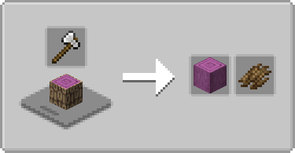
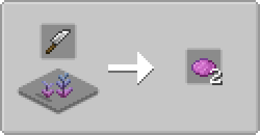
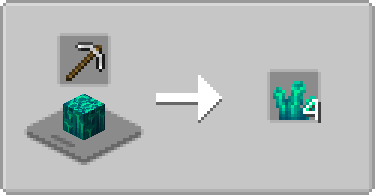

# Farmer's Cutting: BetterEnd
Adds more [Farmer's Delight Refabricated](https://modrinth.com/mod/farmers-delight-refabricated) cutting board recipes for [BetterEnd](https://modrinth.com/mod/betterend)
> Also supports these unofficial [Forge](https://modrinth.com/mod/betterend-forge) and [NeoForge](https://modrinth.com/mod/betterend-neoforge) ports of BetterEnd

- Bark, stripping, recycling for all (applicable) wood types
- More dye from one block high flora that give dye
- Smaragdant crystals can be broken down into shards

  