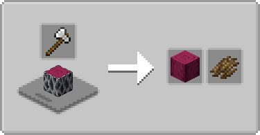
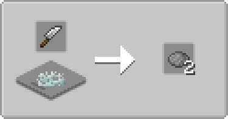

# Farmer's Cutting: BetterNether
Adds more [Farmer's Delight Refabricated](https://modrinth.com/mod/farmers-delight-refabricated) cutting board recipes for [BetterNether](https://modrinth.com/mod/betternether)
> Forge version is available for the unofficial [BetterNether port](https://modrinth.com/mod/betternether-forge)

- Bark, stripping, recycling for all (applicable) wood types
- Gray Mold can be cut into more dye

 