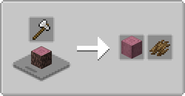
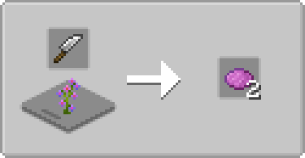
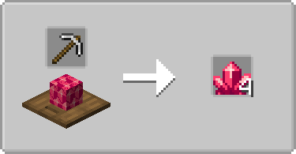
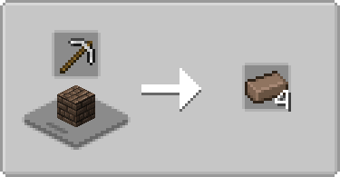

# Farmer's Cutting: Biomes O' Plenty
Adds more [Farmer's Delight](https://modrinth.com/mod/farmers-delight) cutting board recipes for [Biomes O' Plenty](https://modrinth.com/mod/biomes-o-plenty)

- Bark, stripping, recycling for all wood types
- More dye from one block high flowers
- Nether Crystal blocks can be broken down into Nether Crystals
- Mud Bricks can be broken down into Mud Brick(s)

   