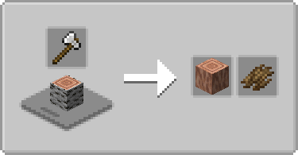
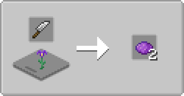
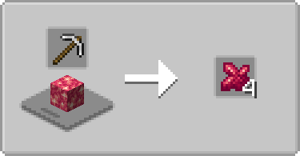

# Farmer's Cutting Collection
Adds more [Farmer's Delight (NeoForge)](https://modrinth.com/mod/farmers-delight) or [Farmer's Delight Refabricated (Fabric)](https://modrinth.com/mod/farmers-delight-refabricated) cutting board recipes for various mods. This is a single data pack combining all the Farmer's Cutting packs for those who would rather download one pack rather than multiple, at the cost of possibly having unusable recipes.

All compiled packs are listed and linked to below (actual content depends on minecraft version):

NeoForge Collection

[Farmer's Cutting: The Aether](../aether/README.md) 
[Farmer's Cutting: Biomes O' Plenty](../biomesoplenty/README.md) 
[Farmer's Cutting: Eternal Starlight](../eternal_starlight/README.md) 
[Farmer's Cutting: Nether's Exoticism](../nethers_exoticism/README.md) 
[Farmer's Cutting: Oh The Biomes We've Gone](../biomeswevegone/README.md) 
[Farmer's Cutting: Regions Unexplored](../regions_unexplored/README.md) 
[Farmer's Cutting: Twilight Forest](../twilightforest/README.md)

Fabric Collection

[Farmer's Cutting: The Aether](../aether/README.md) 
[Farmer's Cutting: BetterEnd](../betterend/README.md) 
[Farmer's Cutting: BetterNether](../betternether/README.md) 
[Farmer's Cutting: Biomes O' Plenty](../biomesoplenty/README.md) 
[Farmer's Cutting: Cinderscapes](../cinderscapes/README.md) 
[Farmer's Cutting: Eternal Starlight](../eternal_starlight/README.md) 
[Farmer's Cutting: Oh The Biomes We've Gone](../biomeswevegone/README.md) 
[Farmer's Cutting: Regions Unexplored](../regions_unexplored/README.md) 
[Farmer's Cutting: Terrestria](../terrestria/README.md)

 

- Bark, stripping, recycling for all (applicable) wood types
- More dye from one block high flora that give dye
- Other cutting recipes depending on mod (refer to the specific Farmer's Cutting pack for more info)

  